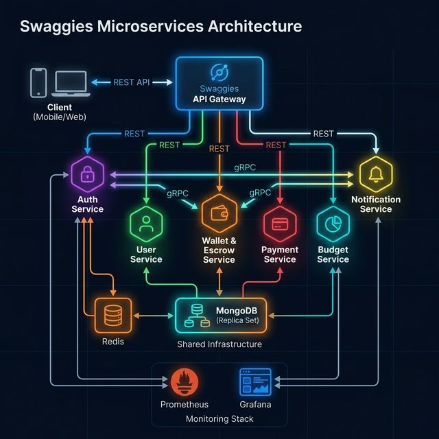

# Swaggies Backend — Enterprise Microservices

[](https://console.cloud.google.com/cloud-build)

> **Highly secure, scalable Node.js microservices backend for a fintech application — deployed on Google Cloud Platform.**

---

## ✨ Core Product Features (The Business Logic)

While the infrastructure is built for enterprise scale, the application layer is laser-focused on solving the biggest bottlenecks in the African gig economy: **Client Friction, Trust, and Currency Devaluation.**

- **Split-Link Architecture (Zero-Friction Checkout)**
  - **The Problem:** Clients abandon invoices when forced to download apps or create accounts.
  - **The Tech:** We engineered a dual-token system. The API generates a public `paymentToken` for a lightweight checkout gateway. Upon successful Flutterwave webhook verification, the system mathematically locks the funds and generates a secure, private `trackingToken` sent to the client's email for milestone management.
- **Dual-Currency FX Vault (Inflation Protection)**
  - **The Problem:** Freelancers lose purchasing power to local currency inflation while waiting for month-long projects to close.
  - **The Tech:** The Wallet Service implements an instant NGN-to-USD conversion engine. Utilizing strict **MongoDB ACID transactions**, freelancers can swap released Naira into a USD Vault, ensuring zero data anomalies or floating balances during the currency swap.
- **Universal Milestone State Machine**
  - **The Problem:** Freelance contracts range from $50 logo designs to $10,000 multi-phase web apps.
  - **The Tech:** A dynamic MongoDB subdocument state machine (`AWAITING` -> `LOCKED` -> `IN_REVIEW` -> `RELEASED`). Standard one-off payments are automatically wrapped into a single 100% tranche, allowing the frontend to use one unified tracking dashboard regardless of contract complexity.
- **Zero-Trust Fund Release (Email OTP)**
  - **The Problem:** If a tracking link is public, malicious actors could approve their own milestones to steal locked funds.
  - **The Tech:** We implemented a cryptographic Email OTP verification flow. When a guest client attempts to release funds, the API intercepts the request, generates a time-boxed 6-digit code via the Notification Service, and requires verification before executing the ledger update.
- **Immutable Dispute & Mediation Engine**
  - **The Problem:** Disagreements over deliverables result in stolen funds or trapped capital.
  - **The Tech:** Clients can trigger a milestone-level freeze. The API flags the specific tranche as `DISPUTED`, halts all ledger movements for that contract, and logs the client's payload for administrative mediation.

---

---

## 📐 Architecture



**Services:**
| Service | HTTP Port | gRPC Port | Database |
|---|---|---|---|
| api-gateway | 3000 | — | — |
| auth-service | 3001 | 5001 | authdb |
| user-service | 3002 | 5002 | userdb |
| wallet-service | 3003 | 5003 | walletdb |
| notification-service | 3004 | 5004 | — |
| payment-service | 3005 | 5005 | paymentdb |
| budget-service | 3006 | — | budgetdb |

---

## 🚀 Local Development

### Prerequisites

- Docker & Docker Compose
- Node.js 20+

### Setup

```bash
# 1. Clone the repository
git clone https://github.com/your-org/Swaggies-backend.git
cd Swaggies-backend

# 2. Create environment files
cp .env.example .env
cp api-gateway/.env.example api-gateway/.env
cp services/auth-service/.env.example services/auth-service/.env
cp services/user-service/.env.example services/user-service/.env
cp services/wallet-service/.env.example services/wallet-service/.env
cp services/notification-service/.env.example services/notification-service/.env
cp services/payment-service/.env.example services/payment-service/.env
cp services/budget-service/.env.example services/budget-service/.env

# 3. Fill in secrets in each .env file
#  NEVER commit .env files to git

# 4. Start all services
npm run start:dev   # equivalent: docker-compose up --build

# 5. Verify services
curl http://localhost:3000/ping   # {"status":"OK","service":"api-gateway"}
curl http://localhost:3000/health
```

### Service URLs (local)

| Service      | URL                                   |
| ------------ | ------------------------------------- |
| API Gateway  | http://localhost:3000                 |
| Prometheus   | http://localhost:9090                 |
| Grafana      | http://localhost:3100 (admin / admin) |
| Alertmanager | http://localhost:9093                 |

---

## ☁️ GCP Deployment

### Prerequisites

- GCP Project with billing enabled
- [`gcloud` CLI](https://cloud.google.com/sdk/docs/install) authenticated
- [`kubectl`](https://kubernetes.io/docs/tasks/tools/) installed
- [`terraform`](https://developer.hashicorp.com/terraform/install) ≥ 1.5 (optional for IaC)

### Step 1 — Provision Infrastructure (Terraform)

```bash
cd _infra/terraform
cp terraform.tfvars.example terraform.tfvars
# Edit terraform.tfvars with your GCP Project ID and settings

terraform init
terraform plan
terraform apply
```

Terraform creates:

- **VPC** with private subnet + Cloud NAT
- **GKE Autopilot cluster** (private nodes, Workload Identity, Binary Authorization)
- **Artifact Registry** repository
- **GCP Service Account** with Secret Manager + Logging + Monitoring IAM roles
- **Static IP** for Ingress

### Step 2 — Store Secrets in Secret Manager

```bash
PROJECT_ID="your-gcp-project-id"

# Store all secrets — never paste into YAML
gcloud secrets create Swaggies-jwt-secret --data-file=- <<< "your-jwt-secret"
gcloud secrets create Swaggies-auth-mongo-uri --data-file=- <<< "mongodb+srv://..."
gcloud secrets create Swaggies-monnify-api-key --data-file=- <<< "MK_LIVE_..."
gcloud secrets create Swaggies-monnify-secret-key --data-file=- <<< "..."
gcloud secrets create Swaggies-monnify-contract-code --data-file=- <<< "..."
# ... add all others from k8s/external-secrets.yaml
```

### Step 3 — Configure Cloud Build Triggers

```bash
# Grant Cloud Build access to GKE
gcloud projects add-iam-policy-binding $PROJECT_ID \
  --member="serviceAccount:$(gcloud projects describe $PROJECT_ID --format='value(projectNumber)')@cloudbuild.gserviceaccount.com" \
  --role="roles/container.developer"

# Create the main build trigger (push to main)
gcloud builds triggers create github \
  --repo-owner=your-org \
  --repo-name=Swaggies-backend \
  --branch-pattern="^main$" \
  --build-config=cloudbuild.yaml \
  --substitutions="_GCP_PROJECT_ID=$PROJECT_ID,_GKE_CLUSTER=Swaggies-cluster,_GKE_REGION=us-central1"

# Create the PR validation trigger
gcloud builds triggers create github \
  --repo-owner=your-org \
  --repo-name=Swaggies-backend \
  --pull-request-pattern="^main$" \
  --build-config=cloudbuild-pr.yaml \
  --substitutions="_GCP_PROJECT_ID=$PROJECT_ID"
```

### Step 4 — Install External Secrets Operator

```bash
# Install ESO (reads GCP Secret Manager → Kubernetes Secrets)
helm repo add external-secrets https://charts.external-secrets.io
helm install external-secrets external-secrets/external-secrets \
  -n external-secrets --create-namespace

# Apply Kubernetes manifests
kubectl apply -f k8s/namespace.yaml
kubectl apply -f k8s/service-account.yaml
kubectl apply -f k8s/configmap.yaml
kubectl apply -f k8s/external-secrets.yaml
kubectl apply -f k8s/network-policy.yaml
kubectl apply -f k8s/api-gateway.yaml
kubectl apply -f k8s/auth-service.yaml
kubectl apply -f k8s/user-service.yaml
kubectl apply -f k8s/services.yaml
kubectl apply -f k8s/hpa.yaml
kubectl apply -f k8s/ingress.yaml
```

### Step 5 — Configure DNS

```bash
# Get the static IP from Terraform output
terraform output ingress_static_ip

# Add an A record in your DNS provider:
# api.Swaggies.com → <static-ip>
```

### Step 6 — Push to deploy

```bash
git push origin main
# Cloud Build automatically:
# 1. Scans for secrets (TruffleHog)
# 2. Builds all 7 Docker images in parallel
# 3. Runs Trivy vulnerability scan (blocks on CRITICAL CVEs)
# 4. Pushes to Artifact Registry
# 5. Deploys to GKE with zero-downtime rolling update
# 6. Runs smoke tests
```

---

## 🔐 Security Architecture

| Layer                  | Control                                                                                  |
| ---------------------- | ---------------------------------------------------------------------------------------- |
| **Secrets**            | GCP Secret Manager via External Secrets Operator — no secrets in git or k8s YAML         |
| **Network**            | Zero-trust NetworkPolicy: deny-all default, explicit allow rules per service             |
| **Images**             | Multi-stage builds, non-root user (UID 1000), read-only filesystem, dropped capabilities |
| **Container scanning** | Trivy in CI blocks CRITICAL CVEs before any image is pushed                              |
| **Secrets scanning**   | TruffleHog in CI blocks any accidental secret commits                                    |
| **Auth**               | JWT verification in shared middleware, token blacklisting via Redis                      |
| **GKE**                | Workload Identity (no service account key files), Binary Authorization                   |
| **TLS**                | Google-managed certificate at Ingress, HTTPS-redirect enforced                           |

---

## 📊 Monitoring

| Tool         | URL (local)    | Purpose                              |
| ------------ | -------------- | ------------------------------------ |
| Prometheus   | localhost:9090 | Metrics collection from all services |
| Grafana      | localhost:3100 | Dashboards (admin/admin default)     |
| Alertmanager | localhost:9093 | Alert routing to Slack               |

All services expose `/metrics` (Prometheus format) and `/health` endpoints.

Alerts configured:

- **ServiceDown** — any service unreachable for > 1 min → critical
- **HighErrorRate** — > 10 errors/min → critical
- **HighLatency** — 95th percentile > 1s → warning

---

## 📁 Directory Structure

```
Swaggies-backend/
├── api-gateway/            # Express API Gateway
├── services/
│   ├── auth-service/       # Authentication, JWT, email verification
│   ├── user-service/       # User profiles
│   ├── wallet-service/     # Wallets, Monnify integration
│   ├── payment-service/    # Payment processing
│   ├── budget-service/     # Budget tracking
│   └── notification-service/ # Email/push notifications
├── shared/                 # Shared middleware, proto files, utilities
│   └── proto/              # gRPC .proto definitions
├── k8s/                    # Kubernetes manifests (GKE)
├── _infra/terraform/       # Terraform IaC for GCP
├── monitoring/             # Prometheus, Grafana, Alertmanager configs
├── cloudbuild.yaml         # CI/CD: main branch deploy pipeline
└── cloudbuild-pr.yaml      # CI/CD: PR validation pipeline
```

---

## 🛠️ NPM Scripts

```bash
npm run start:dev    # docker-compose up --build (full stack)
npm run start        # docker-compose up
npm run stop         # docker-compose down
npm run clean        # docker-compose down -v (also removes volumes)
```

---

## 📄 License

MIT — see [LICENSE](./LICENSE)
